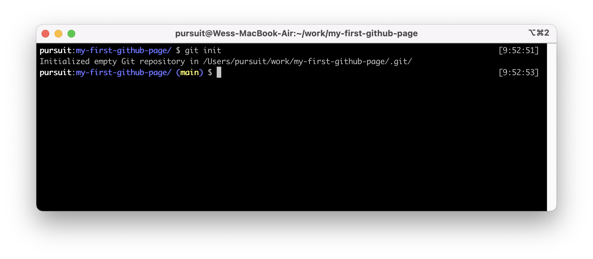
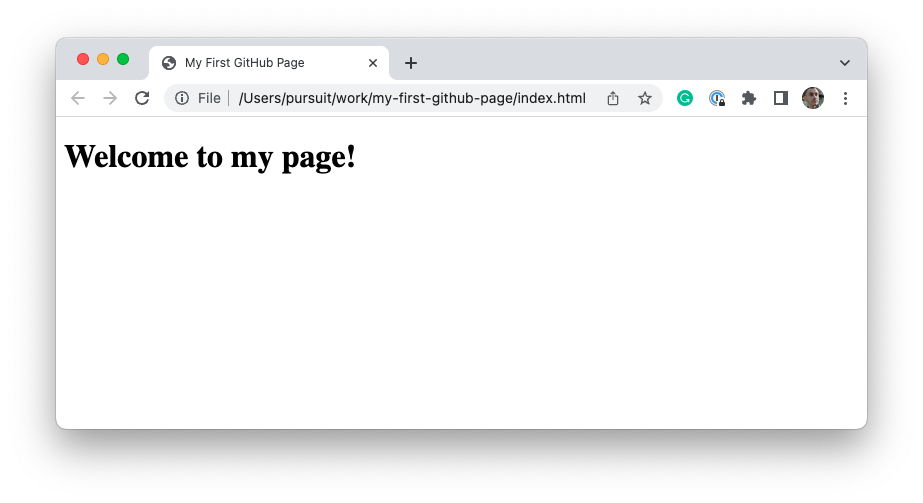
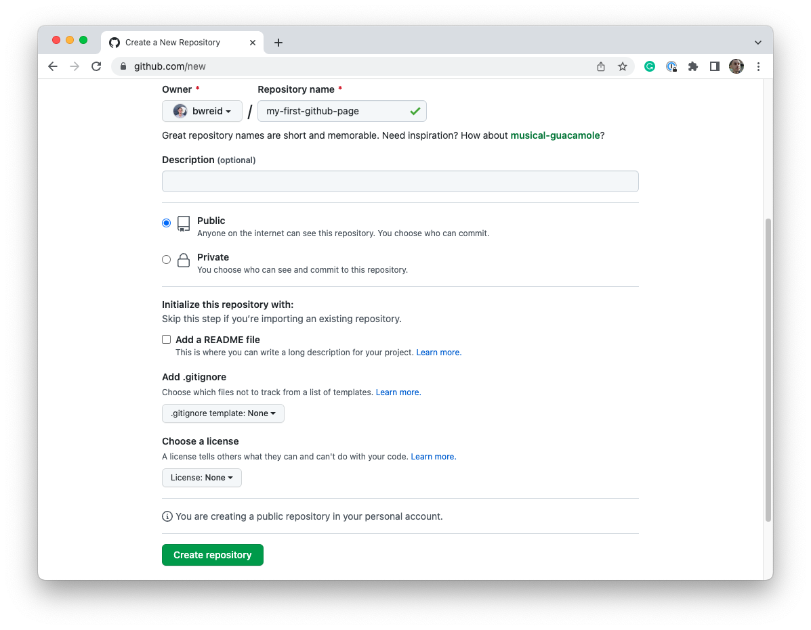
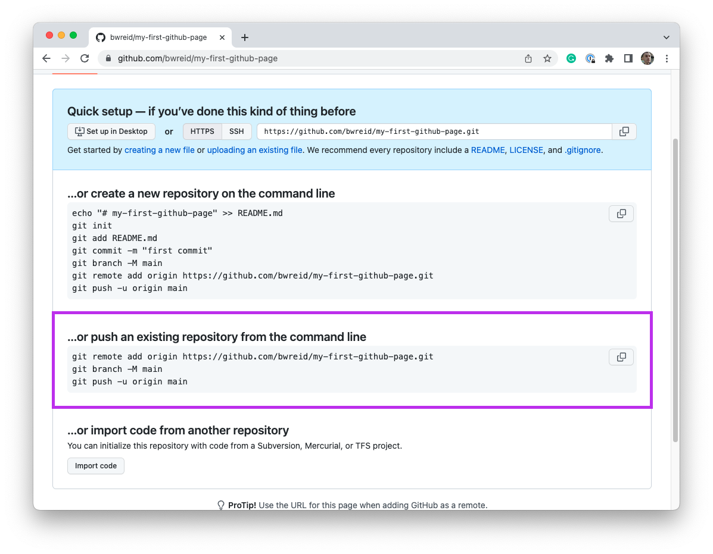
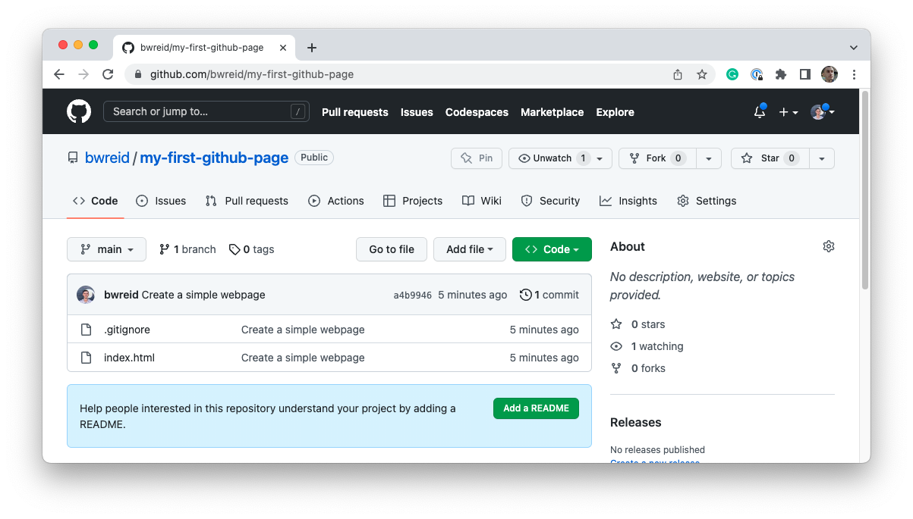
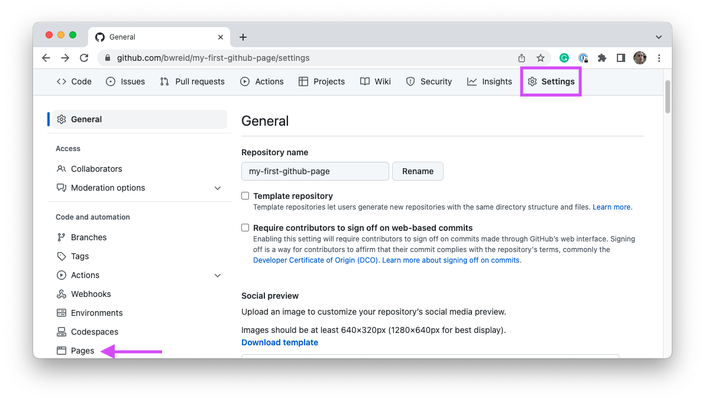
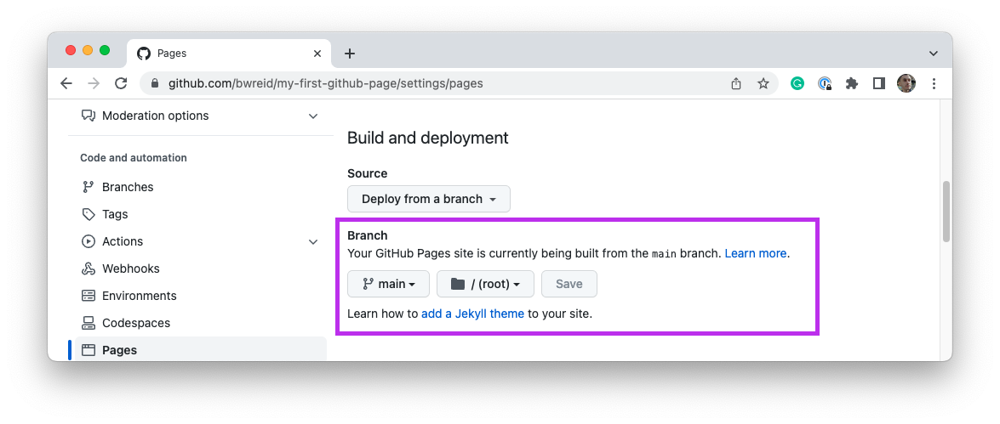
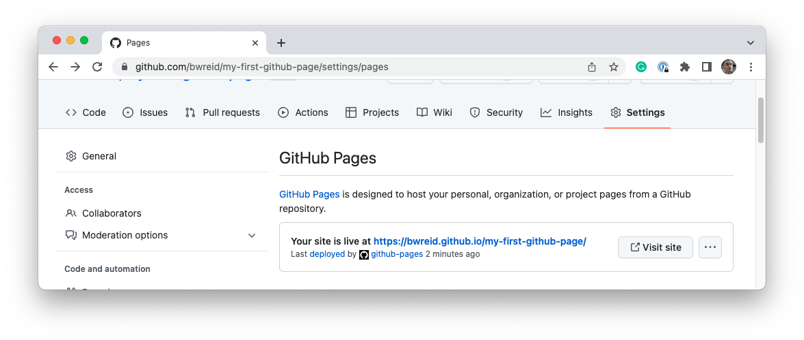

# Deploying with GitHub Pages

GitHub has made it incredibly easy to deploy a simple webpage with the GitHub Pages tool. GitHub Pages is only available for public repositories for free accounts.

To deploy with GitHub pages, you can always review the instructions [on their website](https://docs.github.com/en/pages/getting-started-with-github-pages/creating-a-github-pages-site). This document will briefly go through similar instructions.

## Create a local webpage

First, you will need to create a local project and upload it to GitHub. Begin by creating a new directory called `my-first-github-page/`. Initialize that directory as a git repository.



Next, you will want to create an `index.html` file. Create the file and add the following HTML within that file:

```html
<!DOCTYPE html>
<html lang="en">
  <head>
    <meta charset="UTF-8" />
    <meta http-equiv="X-UA-Compatible" content="IE=edge" />
    <meta name="viewport" content="width=device-width, initial-scale=1.0" />
    <title>My First GitHub Page</title>
  </head>
  <body>
    <h1>Welcome to my page!</h1>
  </body>
</html>
```

You can open up the file in your browser using the following command within your `my-first-github-page/` directory.

```
open index.html
```

You should see a very simple website that looks something like the image below.



Now you need to commit your code. You can do so with the following commands within your terminal.

```
git add -A
git commit -m 'Create a simple webpage'
```

## Upload your webpage to GitHub

Next, create a GitHub repository. To do so, go to GitHub and click the "+" button that allows you to create a new repository. Give your repository a memorable name and then click the **Create repository** button.

> **Note**: Do not initialize the repository with a README file.



Once you've done so, you should see a new page with instructions on how to upload your code to GitHub. Follow the set of instructions that allow you to push an _existing repository_ to GitHub. This will require you to run some commands in your terminal window.



Once you've done so, refresh your browser window. You should now see your code up on GitHub.



## Enabling GitHub Pages

You're very close to seeing your website live on GitHub pages. Click the **Settings** tab on your repository's page. Then, click on the **Pages** link in the sidebar.



On the new page, underneath the "Branch" option, select "main" and then click the **Save** button. The page should update to say that your site is currently being built.



Give GitHub a moment or two and then refresh the page. At the top of the **Settings** page, you should now see a link to your deployed site. Click that link and you will be able to visit your page!


