# Deploying a Vite React App with Netlify

This guide will be a walk-through on getting a React App generated by Vite deployed on Netlify.

## Learning objectives

- Deploy a React application to the web using Netlify.
- Create `.env` configuration files that can be used within a React application created by the Vite program.
- Configure environment variables on the Netlify platform.
- Add redirects when you have separate views using React Router.

## Getting Started

- In the terminal, make sure you are not already inside a git repository, and then type `npm create vite@4 YOUR_APP_NAME` (replace `YOUR_APP_NAME` with the actual name of your app)
- `cd` into this new application and `npm install`.
- Confirm that your app works as expected.
- Go to GitHub and create a new public repository.
- DO NOT select the following options (your React app will already have these things)

- Create a readme
- Add a `.gitignore`
- choose a license

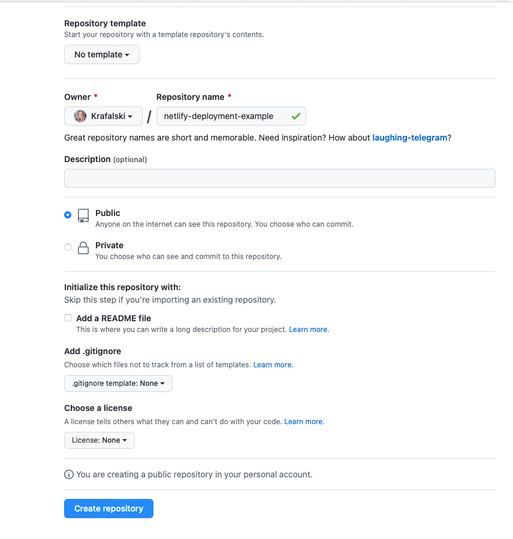

- Return to your React app:
- `git status`
- If the app is not already a git repository:
  - confirm there is a `.gitignore` file that ignores `node_modules`
  - `git init`
  - `git add .`
  - `git commit -m 'first commit'`
- Follow the commands listed in GitHub to push an existing repository to GitHub

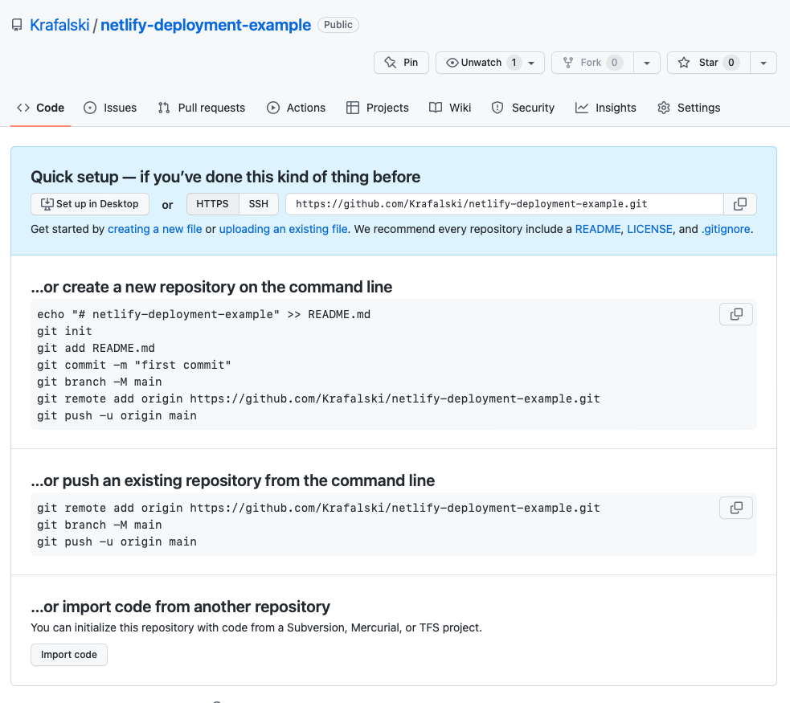

> **Note:** If you do not have the above view for a new GitHub repository, it is easiest to delete it and start again. If you see a different view, you likely selected some options from the previous menu.

- Confirm your React app code is now on GitHub.

**IMPORTANT:** Make sure your application runs locally. If it does not run locally, there is no hope of it working on deployment.

**IMPORTANT:** Deploy early and often. The best time to deploy is right after you've just created your app - the less code you have written, the less work it will take to debug each deployment in case of an issue.

**IMPORTANT:** You should check your application every time you have pushed changes to the main branch to make sure your application still works online.

## Netlify Settings

Log on to (or create an account on) Netlify, go to `Team Overview`, select `Add new site`, then `import an existing project`.

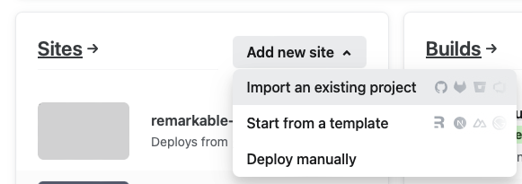

Choose the `Deploy with GitHub` button to access a GitHub authentication view.


Scroll down and select `Configure the Netlify app on GitHub`.


Choose Configure or Log In to authorize Netlify on your GitHub account.

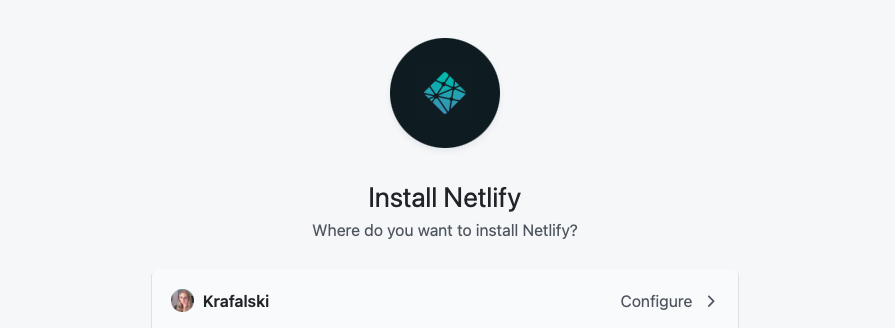

Be sure to remember your GitHub password to move forward.


If you do not see your project, select `Configure the Netlfiy app on Github` at the bottom of the view.

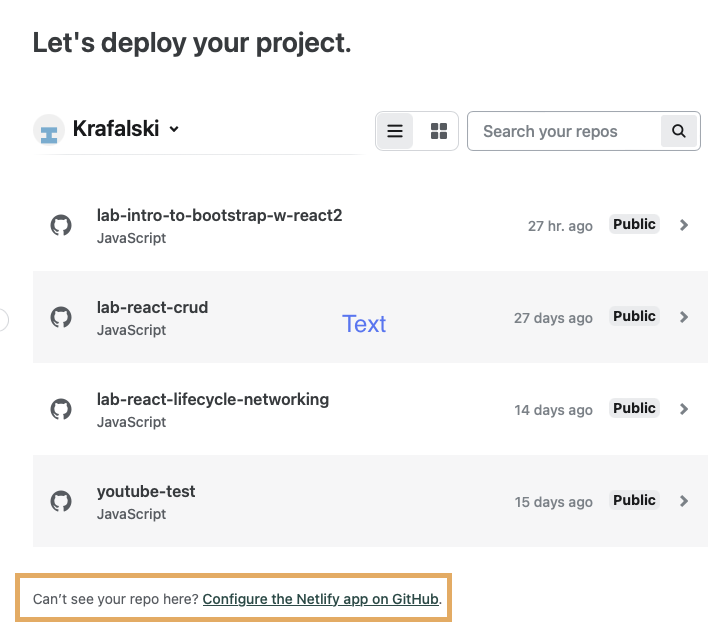

Choose which repo. Use the search bar feature if needed.

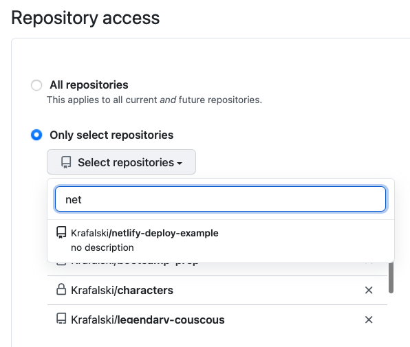

Once selected (you may need to press the `save` button at the bottom), your view should return to the Netlify dashboard. Select your app.

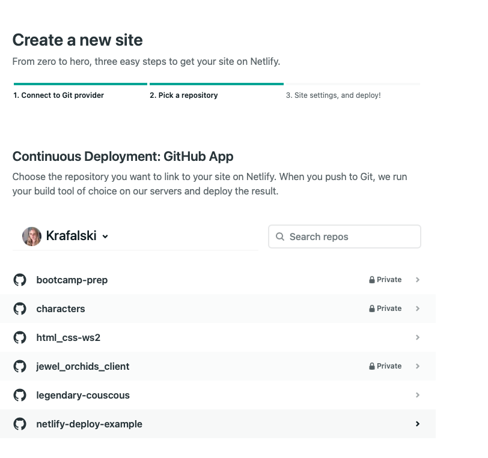

Check the default settings provided and choose the `Deploy` button at the bottom, if you have no environmental variables to add. If you need to add environmental variables scroll down to the next section, then return here once that is set up.

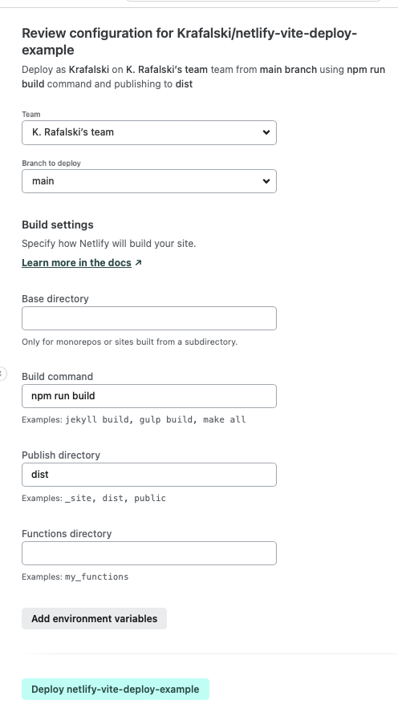

**Note**: Vite's default `Publish directory` is called `dist`. Be sure to confirm this field.

See the status of your deployment. Click on your app in `Production Deploys` to see more details.

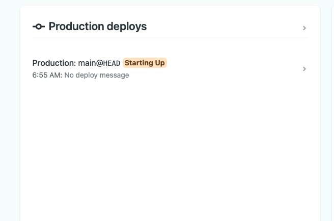

Click on your app and check the logs. It is good to get familiar with what is there. When errors occur with the build, this is where you would go to learn what to debug.


Check for the line `Site is live ✨` to confirm your site is live.

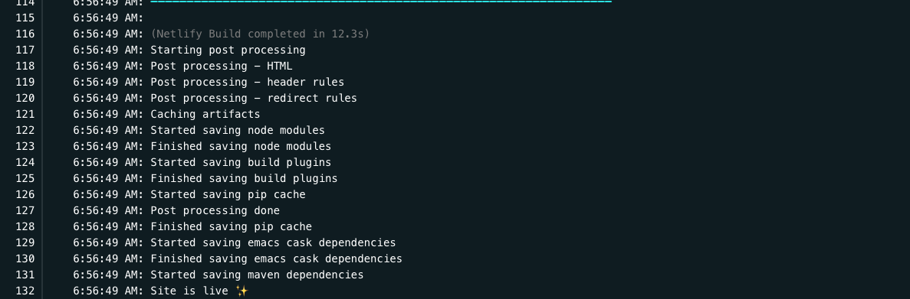

Go to the `Deploys` tab, and click the link to see your site live. You can also share this link with your friends and family!

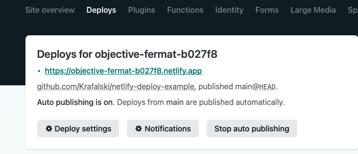

While adding to your app, you should work on another branch like `dev` and only merge into `main` when your new features are working.

Think about a professional setting. You will be very unhappy if you visit your favorite website and it is down. Therefore, applications must be built and tested on other branches, and only working changes are merged to the `main` branch.

This workflow would look similar to this:

```bash
git add -A
git commit -m "New feature added"
git push origin dev
```

Then go to GitHub, open a pull request for your `dev` branch, and follow the steps to merge your changes from `dev` into `main`.

Once continuous deployment is set up, changing to `main` will trigger Netlify to start a new build.

Note:

- Give your site a few minutes to build.
- Check the Netlify dashboard and live site to ensure everything works correctly.

## Adding environmental variables to your application

With Vite App, you can add environmental variables using a `.env` file. Git does not track this file (it should be listed in the `.gitignore`).

All of the environmental variables must start with

```
VITE_
```

Here is an example:

```
VITE_KEY=my-secret-key-value
```

This file is not written in JavaScript, so do not use quotes or semi-colons.

To use this variable in your application. Choose a component where you will use this variable and write:

```js
// Example file: src/App.js
import.meta.env.VITE_KEY;
```

You can confirm that you are getting the expected value by logging it:

```js
// Example file: src/App.js
console.log(`${import.meta.env.VITE_KEY}`);
```

## Adding environmental variables to your Netlify deployment

If you are deploying the app for the first time, when you have the `Review configuration`, you can immediately use the `Add environmental variables` button. However, at any later time, you can also choose `site settings`, then in the `General` menu, find `Build and deploy`, then choose `Environment`.

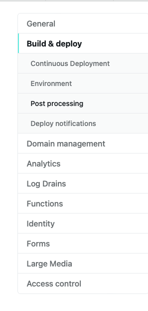

Add, edit, and delete environmental variables here.

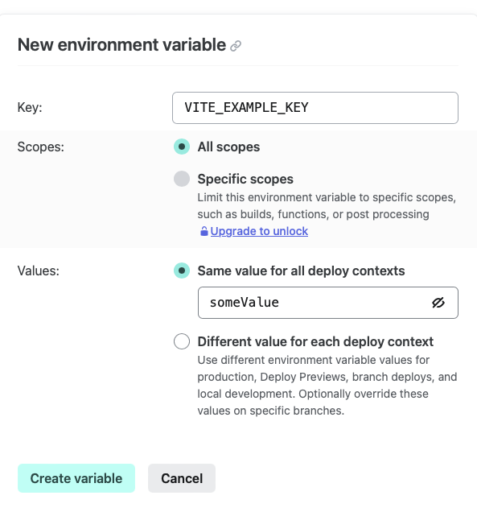

The name of these variables should match what is in your app.

In summary, you will have a `.env` file that will only be on your computer. It will not be tracked with git and should not end up on GitHub. To add the values inside the `.env` file, you will go to your app's Netlify settings page and add them there to make them available for the live version of your application.

> **Note:** This method of hiding the API key is sufficient for free API keys. If you are using more valuable keys (ones that require you to use a credit card), you will want to take extra steps for security. You can read about [further steps to take on the Netlify website](https://answers.netlify.com/t/support-guide-how-do-i-keep-my-api-keys-tokens-safe-using-netlify-functions/293).

## Allow for links to different views

The default configuration on Netlify only shows a React App's root (home page) view. If you have configured React Router, have an `about` page (or any other page view), and sent a URL to the `/about` page to a friend, it will give a 404 or redirect back to the home view.

To configure the ability to send a specific page view URL, you must create a file called `_redirects` inside your app's `public` folder.

This file (**public/\_redirects**) must contain the following text:

```
/* /index.html 200
```
